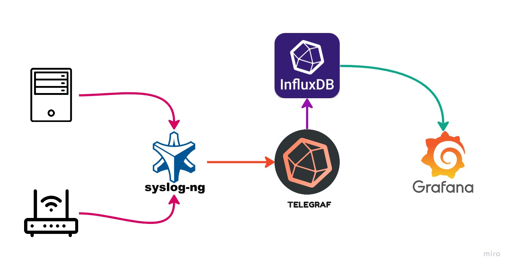
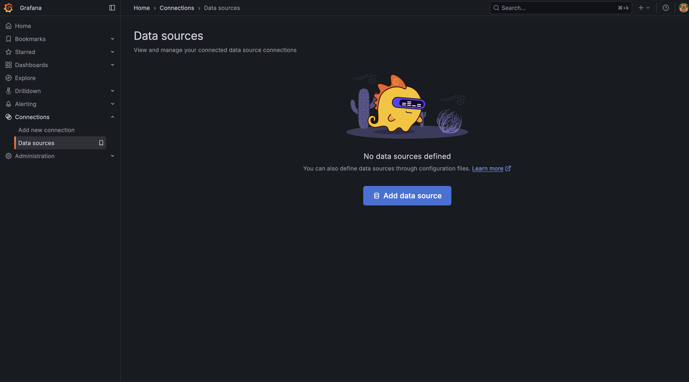
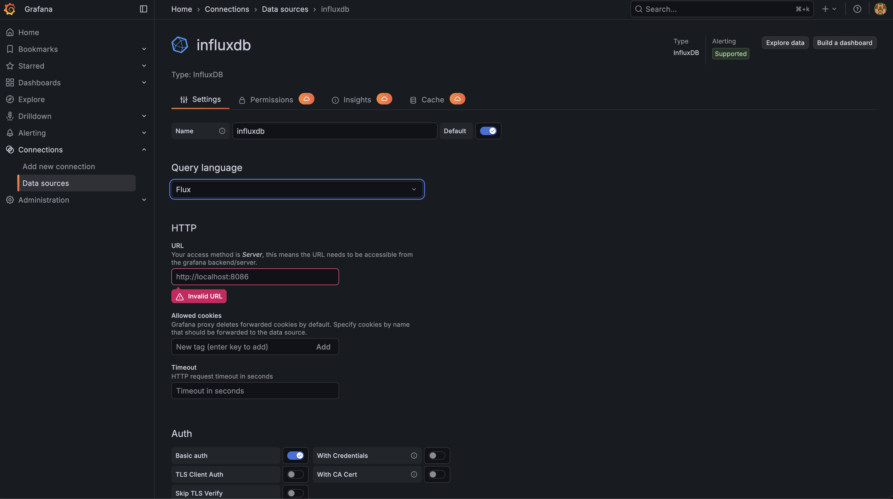
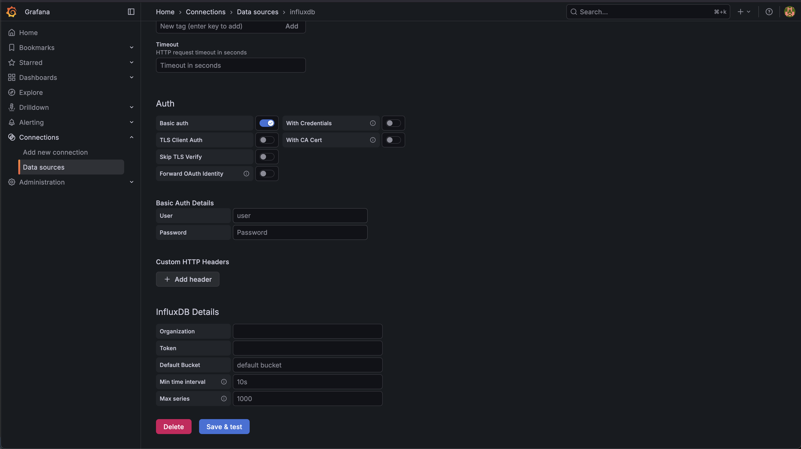

# 📊 Grafana-InfluxDB 2.x Syslog Server 🚀

## A Comprehensive Guide to Setting Up a Scalable Syslog Solution 📝

This guide provides detailed instructions for deploying a robust and scalable syslog server using Grafana, InfluxDB 2.x, Telegraf, and Syslog-ng. Whether for home use or enterprise environments, this solution offers efficient log collection, storage, and visualization. 🏠🏢

# How It Works ⚙️

Initially, UDP logs are directed to the Syslog-ng container. This container then forwards the logs to Telegraf, which is responsible for parsing and structuring the data. The processed data is then pushed into InfluxDB for storage. Finally, Grafana is used to visualize and query these logs, providing insightful dashboards.

### Why Syslog-ng? 🤔

Telegraf's syslog input plugin has limitations regarding UDP syslog formats. As per its official [documentation](https://github.com/influxdata/telegraf/blob/master/plugins/inputs/syslog/README.md):

> By default RFC5424 is used. RFC3164 only supports UDP transport (no streaming support)

To overcome this, Syslog-ng acts as an intermediary. It receives the logs and formats them into a structure that Telegraf can readily accept.

*(**Note**: If your logs are already being sent from `rsyslog` or `syslog-ng` in a compatible format, you can bypass the dedicated Syslog-ng container and send data directly to Telegraf. This requires modifying the `docker-compose.yml` file to expose the **TCP** port for Telegraf.)*

# This is how it works:


# Installation Guide 🚀

To get started, ensure you have [Docker](https://docs.docker.com/engine/install/) and [Docker Compose](https://docs.docker.com/compose/install/) installed on your operating system.

1.  **Clone the Repository**:
    ```bash
    git clone https://github.com/AAm-kun/Grafana-Influxdb_2.x-Syslog-server.git
    ```

2.  **Navigate and Configure**:
    Change into the cloned directory and modify the `docker-compose.yml` file to adjust parameters as per your requirements.

3.  **Launch the Stack**:
    Open your terminal within the project directory and execute the following command:
    ```bash
    sudo docker compose up -d
    ```
    *(This command is compatible with both Docker Compose V1 and V2.)*

### Grafana Configuration 📊

Once all containers are running successfully, access the Grafana web interface via your browser at [http://localhost:3000](http://localhost:3000).

1.  **Initial Login**:
    *   Default credentials: `admin`/`admin`.
    *   **Important**: Change these default credentials immediately for security reasons.

2.  **Add InfluxDB Data Source**:
    *   Navigate to `Connections` -> `Add new connection` -> `InfluxDB`.
    *   Configure the fields according to your `docker-compose.yml` file.
    *   Ensure you select `flux` as the **Query Language**.
    *   Provide the InfluxDB token from your `docker-compose.yml` file.
    *   Your configuration page should resemble the following (credentials may vary):
        
        
        
    *   Click `Save & Test`. A success notification will confirm your data source is working correctly.

3.  **Import Syslog Dashboard**:
    *   Go to `Dashboards` -> `New` -> `Import`.
    *   Enter the Grafana dashboard ID `[18679](https://grafana.com/grafana/dashboards/18679-syslog/)` and click `Load`.
    *   Select your configured InfluxDB data source and click `Import`.
    *   You should now see your syslog data visualized in the dashboard!

### Final Step: Configure Your Devices 💻

Finally, configure your servers or routers to send syslog messages to your newly set up syslog server's IP address and port.


